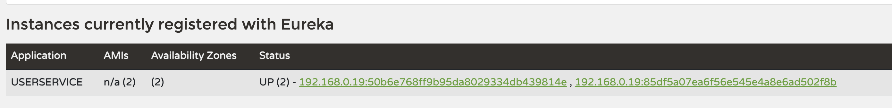

= Service Discovery
:image-url1: https://cdn.jsdelivr.net/gh/jeon3029/learning_cloud@master/spring_cloud/img/img1_1.png

== Netflix eureka Server

서비스를 등록할 수 있는 서버

link:./discovery/discoveryservice[Eureka Server Example]

== Netflix eureka Client

뒷단에 연결될 clinet server 들
* 포트를 각각 다르게 실행시켜야 함.
-> `server.port` 를 0 으로 하면 매번 실행될 때 random 으로 실행 됨

link:./discovery/discoveryservice[User Client Example]

== Result

 

