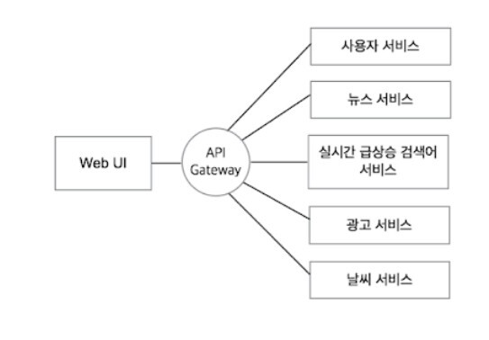
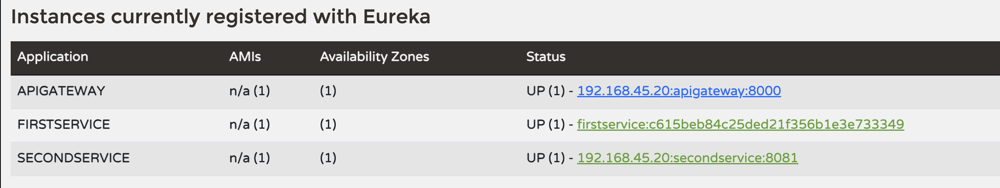

= Api Gateway

 

== API Gateway의 장점

. 공통 로직의 처리
image:3.png[]
. 동일한 요청에 대한 불필요한 반복 작업을 줄일 수 있는 캐싱
. 시스템 상을 오고가는 요청과 응답에 대한 모니터링
..  단순 분석 목적뿐 아니라, 향후 감사 목적용, API 미터링 & 차징, Qos..
. 시스템 내부에 아키텍처를 숨길 수 있음
. 인증 및 인가(ssl offloading)
.. 보통 API 게이트웨이가 하지 않고 뒷단에 있는 인증 서버가 이를 수행
.. 권한 정보를 토큰 자체에 저장하느냐 또는 서버에 저장해놓느냐
... 토큰으로 발급한다면 파기가 불가능하기 때문에 토큰 통제가 어렵다는 단점
. 속도제한, ACL, 회로차단 등등.. 
.. DDoS(분산 서비스 거부) 공격으로부터 보호
. 버전 관리와 업데이트 제어?
.. API Gateway를 통해 트래픽을 새로운 버전으로 전환하거나 기존 버전을 유지

-> 서버 리소스 사용량이 증가하고, ApiGW 가 single point failure 가 될 수 있으므로 scale-up,out 이 적절하게 이루어 져야 한다.

== 서비스 디스커버리

API Gateway는 각 서비스를 호출하기 위해, 서비스마다 IP 주소와 포트 번호를 알고 있어야 함
. 백엔드 서비스의 위치와 상태를 파악( IP 주소, 포트 번호, 엔드포인트 등) -  Netflix의 Eureka 등 사용
. 로드밸런싱(백엔드 서비스들 사이에 부하 분배)

== Spring cloud Gateway with Eureka Discovery

 
