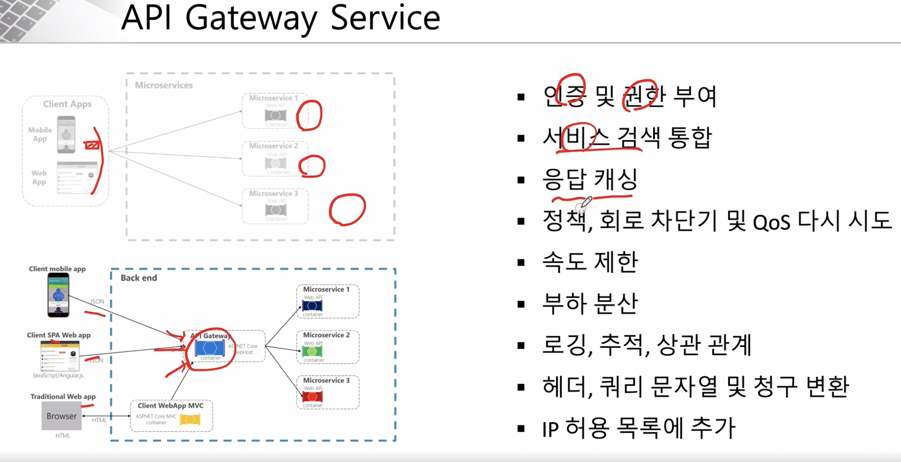

= Api Gateway

.Apigateway 를 앞단에 두는 이점
 

== Netflix Ribbon

* Spring cloud 에서의 MSA 통신?
** RestTemplate
** Feign Client

* Ribbon : Client side 에서 어떤 msa 를 호출할 지 판단하는 load balancer
** Spring-boot 2.4 부터 Maintenance 상태
** 비동기 처리에 적합하지 않음

== Netflix Zuul

* Gateway 역할
** Spring-boot 2.4 부터 Maintenance 상태
** zuul1 은 비동기 지원하지 않음
** https://spring.io/blog/2018/12/12/spring-cloud-greenwich-rc1-available-now[]

== Spring cloud Gateway

link:./gateway[SCG sample]

== Spring cloud Gateway with Eureka Discovery

* route 정보를 eureka 서버로 부터 받음

link:./gateway[SCG sample]

.dependency 추가 필요
[source,xml]
----
<dependency>
  <groupId>org.springframework.cloud</groupId>
  <artifactId>spring-cloud-starter-netflix-eureka-client</artifactId>
</dependency>
----

.설정 활성화 필요
[source,yaml]
----
eureka:
  client:
    register-with-eureka: true
    fetch-registry: true
    service-url:
      defaultZone: http://localhost:8761/eureka
----

